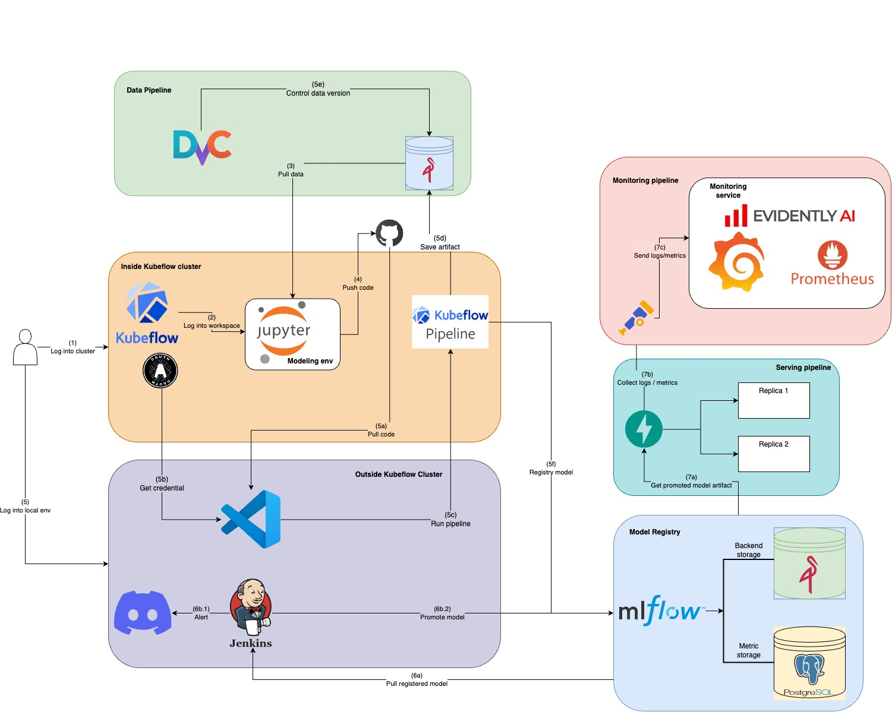

# An unified platform for Credit modeling

* Contents:
  * [Introduction](#introduction)
  * [Repository structure](#repository-structure)
  * [Repository structure](#repository-structure)
  * [Setting up GCP](#setting-up-gcp)
  * [Prerequisites installation](#prerequisites-installation)
  * [Component Preparation](#component-preparation)
  * [Usage](#usage)
  * [CICD pipeline](#cicd-pipeline)
<!-- /code_chunk_output -->

**Disclaimer**: This is a version 1.2 of this project, I will keep updating this project to make it more complete and useful.

You can refer to this github repo that I pushed in Kubeflow notebook in this link : [git-underwrite-mlflow](https://github.com/dohuyduc2002/git-underwrite-mlflow), there also documentation in here to setup git and basic usage of Kubeflow notebook workspace. 



## Introduction
This project is an unified platform for Datasciene team whom working on Credit modeling sector. This repo will help and guide you to build and serve ML model as in a production environment (Google Cloud Platform). I also used tool & technologies to quickly deploy the ML system into production and automate processes during the development and deployment of the ML system.

## Repository structure
```txt
Root
├── dockerfiles                         *  All Dockerfiles for the project
├── helm-charts                         *  Helm charts for deploying components in this project            
│   ├── api                             *  Custom Helm chart for the API component                  
│   ├── jenkins                         *  Custom Helm chart for Jenkins
│   ├── minio                           *  Custom Helm chart values for MinIO
│   ├── mlflow                          *  Custom Helm chart values for MLflow
│   └── monitoring                      *  Custom Helm chart values for Prometheus and Grafana
├── Jenkinsfile                         *  Jenkins pipeline file for CI/CD
├── kubeflow                            *  Kubeflow deployment files
│   ├── dashboard                       *  Custom Kubeflow Central Dashboard
│   ├── kfp-access                      *  Custom Kubeflow Pipelines access in Notebook
│   ├── kind.yaml
│   ├── manifests                       *  Kubeflow manifests v1.10
│   ├── notebook                        *  Custom Kubeflow Notebook
│   ├── README.md
│   └── svc_mesh                        *  Istio service mesh to export Kubeflow services
├── LICENSE
├── media                               *  Media files for the project
│   └── diagram.jpg
├── patch_vs.sh                         *  Script to patch the Kubeflow virtualservice and gateway
├── README.md
├── src                                 *  Source code for the project
│   ├── client                          *  Client code for the project
│   ├── kfp_outside                     *  Code for running Kubeflow pipelines outside of the Kubeflow cluster
│   └── ui                              *  UI code for the project
├── terraform                           *  Terraform files for deploying the project
│   ├── gce                             *  Deploying Jenkins in GCE 
│   └── gke                             *  Deploying the project in GKE
├── testing                             *  Testing files for the project
```
## To-Do
- [ ] Optimize GKE, GCE usage to fit GCP quota for all resources instead of using GCP and Azure
- [ ] Implement Data Ingestion, Data Quality check, Data Lake, Data Warehouse, and Data Pipeline
- [ ] Implement Kserve for model serving
- [ ] Code refactoring and deduplication
- [ ] Refractor API helm deployment and Cloudbuild pipeline
- [ ] Add media files 
## Setting up GCP

1. Create a Google Cloud account and set up billing.
After creating GCP account, create a new project and enable billing for it. You can follow the official [GCP account registration guide](https://cloud.google.com/docs/authentication/getting-started) to create a GCP account and set up billing.

media...

Next, navigate to [Compute Engine API UI](https://console.cloud.google.com/marketplace/product/google/compute.googleapis.com) to "ENABLE" Compute Engine API:

Navigate to [Kubernetes Engine API UI](https://console.cloud.google.com/marketplace/product/google/container.googleapis.com) to "ENABLE" Kubernetes Engine API:

Navigate to [Cloud Builder API UI](https://console.cloud.google.com/marketplace/product/google/cloudbuild.googleapis.com) to "ENABLE" Cloud Build API:

2. Instal gcloud cli
Because this project is running on GKE, you need to install gcloud cli to manage GCP resources. You can follow the official [Gcloud installation guide](https://cloud.google.com/sdk/docs/install) 

3. Create GCP service account
To enable usage of GCP resources, you need to create a service account and assign it the necessary roles. You can follow the official [GCP service account guide](https://cloud.google.com/iam/docs/service-accounts) to create a service account and assign it the necessary roles. After that, save it as a json file into `terraform/gce` and `terraform/gke` folder.

## Prerequisites installation
This is the environment I used to run this project:
- Client Version: v1.32.3
- Kustomize Version: v5.5.0
- Server Version: v1.32.0

1. Install Kubernetes

Since both Kubernetes and Kind are written in Golang, you need to install Golang first.  
You can follow the official [Golang installation guide](https://golang.org/doc/install) or run the following commands:

```bash
sudo apt update
sudo apt install -y golang-go
```

Be sure to check Kustomize version cause this will be used to deploy Kubeflow. 

```
curl -Lo kustomize.tar.gz https://github.com/kubernetes-sigs/kustomize/releases/download/kustomize%2Fv5.5.0/kustomize_v5.5.0_linux_amd64.tar.gz
tar -xzf kustomize.tar.gz
chmod +x kustomize
sudo mv kustomize /usr/local/bin/
```

Install Krew for Kubectl plugins, you can install Krew by following this link: [Krew installation](https://krew.sigs.k8s.io/docs/user-guide/setup/install/)


For convinience when using Kubeflow, you can install these Kubectl plugins and alias:
```
echo "alias k=kubectl" >> ~/.bashrc
source ~/.bashrc
kubectl krew install ctx
kubectl krew install ns
echo "alias kubectx='kubectl ctx'" >> ~/.bashrc
echo "alias kubens='kubectl ns'" >> ~/.bashrc
```

2. Install Terraform

Terraform is an open-source infrastructure as code (IaC) tool that allows you to define and provision infrastructure using a declarative configuration language. It enables you to manage cloud resources, such as virtual machines, networks, and storage, in a consistent and repeatable manner. You can follow the official [Terraform installation guide](https://learn.hashicorp.com/tutorials/terraform/install-cli) to install Terraform.

### GCP deployment
1. Create a GCP project and enable the following APIs:
   - Kubernetes Engine API
   - Compute Engine API
2. Create GKE cluster using Terraform as IaC
```bash
cd terraform/gke

terraform init
terraform plan
terraform apply
```
The output from `outputs.tf` file will show you GKE cluster name, endpoint and project id. For this project, I'm using e2-standard-8 with 1 node which will be a back-end nodes and a routing node. 
I'm using default VPC network provided by GKE cluster when creating the cluster. If you prefer to use your own VPC to issue own IP address range, you can modify the `main.tf` 

3. Switch context to GKE cluster 
```bash
gcloud container clusters get-credentials <cluster-name> --region <region> --project <project-id>
```
after this, you can use `kubectx` to switch context to GKE cluster.

That all the infrastucture you need to install. 

## Component Preparation
In this section, I will guide you to install and configure all the components in this project.
### Initialize Kubeflow cluster
Kubeflow is an open-source platform designed to facilitate the deployment, orchestration, and management of machine learning (ML) workflows on Kubernetes. It provides a set of tools and components that enable data scientists and ML engineers to build, train, and deploy ML models at scale.

To install Kubeflow, first you clone the Kubeflow manifest repo [Kubeflow manifest 1.10](https://github.com/kubeflow/manifests/tree/v1.10-branch). I have already cloned this repo in `kubeflow/manifests` folder. 

After that, you can install Kubeflow using the README file in `kubeflow/manifests` folder. 

### Expose Kubeflow to the internet
While using GKE cluster, you can not use `kubectl port-forward` to access the Kubeflow central dashboard. To expose Kubeflow to the internet, you need to do following steps:

1. Create Istio LoadBalancer service inside `istio-system` namespace
Because we need to keep internal service mesh for Kubeflow services, the new Istio LoadBalancer service will take external IP from GKE cluster and route all traffic to the internal Istio ClusterIP service mesh. 

```bash
cd svc_mesh
k apply -f istio-ingressgateway-lb.yaml
```
Wait for a few minutes until `istio-ingressgateway-lb` service got `EXTERNAL-IP` address. You can check the status of the service by running the following command:

```bash
k get svc istio-ingressgateway-lb -n istio-system
```

2. To ensure that service mesh is working inside the cluster, you have to patch all virtual services in Kubeflow to use the new Istio LoadBalancer service. *Remember to change the HOST="kubeflow.<ExternalIP>.nip.io"* in `patch_vs.sh` file to your own Istio LB external IP address. 
```bash 
bash patch_vs.sh
```
This command will patch all virtual services with new Istio LoadBalancer gateway and host.

```bash
# Get all virtual services
k get virtualservices -A 
```
After that, you can access Kubeflow central dashboard using the following URL:

```bash
http://kubeflow.<EXTERNAL-IP>.nip.io
```
**Using Kubeflow Pipelines Inside Kubeflow Notebook**:
After Kubeflow manifests version v1.7, the default button to allow pipeline to run inside the namespace is removed, we need to add this manually by providing `kubeflow-user-example-com` Service Account and add RBAC role to Pod Default. 

```bash
cd kubeflow/kfp-access
k apply -f kfp-access.yaml
```
You can also based on this template to add your own configuration button like add GCP credential, Wandb credential, etc.

If you prefer to hide your IP address, you can use sample DNS at your local machine

```bash
sudo nano /etc/hosts

<ISTIO-EXTERNAL_IP> ducdh.kubeflow.com
```

### Initialize Minio
Im using Minio helm chart to deploy Minio in this project. You can find the helm chart in `minio` folder which is cloned from this repo [Minio community helm chart](https://github.com/minio/minio/blob/master/helm/minio/README.md)

```bash
helm repo add minio https://charts.min.io/

helm install minio minio/minio \
  --namespace minio \
  --create-namespace \
  --set mode=standalone \
  --set rootUser=minio \
  --set rootPassword=minio123 \
  --set persistence.size=10Gi \
  --set service.type=ClusterIP \
  --set resources.requests.memory=2Gi 

```
### Initialize Mlflow 
MLflow is an open-source platform designed to manage the end-to-end machine learning lifecycle. It provides tools for tracking experiments, packaging code into reproducible runs, and sharing and deploying models.

Im using MLflow community helm chart to deploy MLflow in this project. You can find the helm chart in `mlflow` folder which is cloned from this repo [MLflow community helm chart](https://github.com/community-charts/helm-charts/tree/main/charts/mlflow)

```bash
cd helm-charts/mlflow
helm install mlflow community-charts/mlflow \
  --namespace mlflow \
  --create-namespace \
  --set ingress.enabled=false \
  -f custom-values.yaml

```
We initialize Postgres database for MLflow backend store.
```bash
cd helm-charts/mlflow
k apply -f postgres.yaml
```
I'm using Postgres as backend store and Minio as artifact store. This can be configure using this cmd

```bash
helm upgrade --install mlflow community-charts/mlflow \
  --namespace mlflow \
  --create-namespace \
  --reuse-values \
  \
  --set backendStore.databaseMigration=true \
  --set backendStore.postgres.enabled=true \
  --set backendStore.postgres.host=postgres-service \
  --set backendStore.postgres.port=5432 \
  --set backendStore.postgres.database=postgres \
  --set backendStore.postgres.user=postgres \
  --set backendStore.postgres.password=postgres \
  \
  --set artifactRoot.s3.enabled=true \
  --set artifactRoot.s3.bucket=mlflow \
  --set artifactRoot.s3.awsAccessKeyId=minio \
  --set artifactRoot.s3.awsSecretAccessKey=minio123 \
  \
  --set extraEnvVars.AWS_ACCESS_KEY_ID=minio \
  --set extraEnvVars.AWS_SECRET_ACCESS_KEY=minio123 \
  --set extraEnvVars.AWS_REGION=us-east-1 \
  --set extraEnvVars.MLFLOW_S3_ENDPOINT_URL=http://minio.minio.svc.cluster.local:9000 \
  --set extraEnvVars.MLFLOW_S3_IGNORE_TLS="true" \
  --set extraEnvVars.AWS_S3_ADDRESSING_STYLE="path" \
  \
  --set serviceMonitor.enabled=true
```

### Initialize Prometheus-Grafana
To monitor the system, I'm using Prometheus and Grafana. Prometheus is an open-source systems monitoring and alerting toolkit originally built at SoundCloud. Grafana is an open-source platform for monitoring and observability. I'm using Kube-prometheus-stack helm chart to deploy Prometheus and Grafana in this project. You can find the helm chart in `monitor` folder which is cloned from this repo [Kube-prometheus-stack helm chart](https://github.com/prometheus-community/helm-charts/tree/main/charts/kube-prometheus-stack)

```bash
helm install kps prometheus-community/kube-prometheus-stack -n monitoring --create-namespace
```

#### Prometheus
I'm setting up Prometheus to monitor system metric through OpenTelemetry. I already added alert rules in the `helm-charts/monitoring/custom-values.yaml` file. 

#### Grafana
Grafana is a powerful open-source analytics and monitoring solution that integrates with various data sources, including Prometheus. It provides a rich set of features for visualizing and analyzing time-series data. I'm also modified Grafana in `helm-charts/monitoring/custom-values.yaml`.


Create json for Grafana dashboard, apply it through configmap in `src/client/grafana` folder

```bash
cd src/client/grafana
k create configmap model-dashboard \
  --from-file=model-dashboard.json \
  -n monitoring \
  -o yaml --dry-run=client | kubectl apply -f -

k label configmap model-dashboard grafana_dashboard=1 -n monitoring --overwrite

k rollout restart deployment kps-grafana -n monitoring
```
You can also check other Grafana dashboards in [Grafana lab](https://grafana.com/grafana/dashboards/), in this project, I'm using Node Exporter Full dashboard to monitor the all cluster nodes.

media ... 

### Serve model with FastAPI and collect log 
In the endpoint API, the application is pulling model from Mlflow artifact storage which is under Minio bucket `mlflow` from Minio deployment in `minio` namespace. The model joblib is stored in `mlpieline` bucket from Minio under `kubeflow` namespace. This app consist 2 POST method, one is raw prediction which used to predict new customer which is not in the existed database. The 2nd one is predict by id which customer is already existed in the database. 

I'm also collecting prediction log using OpenTelemetry and send it back to Prometheus. The metrics dashboard is created in Grafana throguh a configmap that created above .

There are 2 ways to deploy endpoint api
1. Manual: You can deploy the endpoint manually by using the following command:
2. CICD : The endpoint is automatically deployed when the Jenkins pipeline run success 

In this section, we will use the manual way to deploy the endpoint API.

```bash
cd helm-charts/api
helm install api . \
  --namespace api \
  --create-namespace \
  --set monitoring.enabled=true \
  --set image.tag=latest \
  --set replicaCount=1
```
Because endpoint app is pulling artefact from Minio, you need to add secret to this namespace. 
```bash
k create secret generic minio-creds \
  --from-literal=access_key=minio \
  --from-literal=secret_key=minio123 \
  -n api
```

### Ingress controller for all services
While using GKE cluster, you can not use `kubectl port-forward` to access the services. To expose all services to the internet, you need to install NginX ingress controller and create ingress for each service. Kubeflow is already exposed in previous step.
1. Install NginX ingress controller 

```bash
helm repo add ingress-nginx https://kubernetes.github.io/ingress-nginx

helm install ingress-nginx ingress-nginx/ingress-nginx \
  --namespace ingress-nginx \
  --create-namespace \
  --set controller.service.type=LoadBalancer \
  --set controller.service.externalTrafficPolicy=Cluster
  --set controller.resources.requests.cpu=100m \
  --set controller.resources.requests.memory=90Mi
```
2. Wait for a few minutes until `ingress-nginx` service got `EXTERNAL-IP` address. You can check the status of the service by running the following command:

```bash
k get svc ingress-nginx-controller -n ingress-nginx
```
3. Helm upgrade all services with custom `values.yaml`

a. Mlflow
```bash
cd helm-charts/mlflow

helm upgrade mlflow community-charts/mlflow \
  --namespace mlflow \
  --reuse-values \
  --set ingress.enabled=true \
  --set ingress.hosts[0].host=mlflow.ducdh.com \
  --set ingress.hosts[0].paths[0].path=/ \
  --set ingress.hosts[0].paths[0].pathType=Prefix

```
b. Monitoring (Grafana, Prometheus, Alertmanager)
```bash
cd helm-charts/monitoring
helm upgrade kps prometheus-community/kube-prometheus-stack \
  -n monitoring \
  -f custom-values.yaml \
  --reuse-values
```
c. Prediction API
```bash
helm upgrade api . \
  -n api \
  --reuse-values \
  --set ingress.enabled=true \
  --set ingress.rules[0].host=api.ducdh.com \
  --set ingress.rules[0].paths[0].path="/" \
  --set ingress.rules[0].paths[0].pathType=Prefix \
  --set ingress.rules[0].paths[0].serviceName=prediction-api \
  --set ingress.rules[0].paths[0].servicePort=8000

```
d. Minio
```bash
cd helm-charts/minio
helm upgrade minio minio/minio \
  --namespace minio \
  --reuse-values \
  --set ingress.enabled=true \
  --set ingress.ingressClassName=nginx \
  --set ingress.hosts[0]=minio.ducdh.com \
  --set consoleIngress.enabled=true \
  --set consoleIngress.ingressClassName=nginx \
  --set consoleIngress.hosts[0]=console.minio.ducdh.com

e. Jenkins 

```
After that, to create a mapping between the domain name and the external IP address of the ingress controller, you can use the following command:

```bash
sudo nano /etc/hosts

<EXTERNAL-IP-NGINX> mlflow.ducdh.com
<EXTERNAL-IP-NGINX> api.ducdh.com
<EXTERNAL-IP-NGINX> minio.ducdh.com
<EXTERNAL-IP-NGINX> console.minio.ducdh.com
<EXTERNAL-IP-NGINX> prometheus.ducdh.com
<EXTERNAL-IP-NGINX> grafana.ducdh.com

```

## Usage 

### Using Kubeflow 
For simplicity, in this project I used default Kubeflow namespace which is `kubeflow-user-example-com`.

After that, you can follow tutorial in this git repo [git-underwrite-mlflow](https://github.com/dohuyduc2002/git-underwrite-mlflow) to setup kubeflow workspace from the UI and git. 

### Using Kserve

under implementation, fixing bug in Kserve *v0.14.1*

### Using Kubeflow Pipeline
**Kubeflow Pipelines** is a powerful platform for building and deploying scalable and reproducible machine learning (ML) workflows based on Kubernetes. It allows data scientists and ML engineers to define workflows as a series of components, each performing a specific task (e.g., preprocessing, training, evaluation).

With Kubeflow Pipelines, you can:
- Track experiments and compare results visually.
- Automate the ML lifecycle from data ingestion to model deployment.
- Reuse pipeline components across projects.
- Scale easily using Kubernetes-native resources.

Ideal for teams working on MLOps, Kubeflow Pipelines simplifies the path from prototype to production.

image pipeline 

#### Using Kubeflow Pipeline outside the cluster

1. First, you have to fill this .env file in `src/kfp_outside` folder to provide credential for Kubeflow pipeline, my credential is 
```
# MinIO configuration
MINIO_ENDPOINT=minio.minio.svc.cluster.local:9000
MINIO_ACCESS_KEY=minio
MINIO_SECRET_KEY=minio123
MINIO_BUCKET_NAME=sample-data

# Kubeflow/Dex Auth Configuration
KFP_API_URL=http://ml-pipeline.kubeflow.svc.cluster.local:8888 
KFP_SKIP_TLS_VERIFY=True
KFP_DEX_USERNAME=user@example.com
KFP_DEX_PASSWORD=12341234
KFP_DEX_AUTH_TYPE=local
```
2. After that, you can run the following command to run the pipeline:
```bash
cd src/kfp_outside
bash run.sh
```

#### Using Kubeflow Pipeline inside the cluster
Refer to this repo [git-underwrite-mlflow](https://github.com/dohuyduc2002/git-underwrite-mlflow) after add Pod default, RBAC and Service account to run pipeline inside the cluster.

### Uploading data to Minio
In this project, I'm tracking all data under `sample-data` bucket in Minio for simplicity. For simplicity, in this project, I'm using minio root user and password which is `minio` and `minio123`.

1. Download data from gdrive using the following command:
```bash
gdown --folder https://drive.google.com/drive/folders/1HCoHY7N0GGCIqFouF3mx9cVKY35Z-p44?usp=drive_link```
```
2. Forward Minio service port to access Minio UI and Minio console
```bash
k port-forward svc/minio -n minio 9000:9000
k port-forward svc/minio-console -n minio 9001:9001
```

3. After that, you can push data to Minio using the following command:
```bash

mc alias set localMinio http://localhost:9000 minio minio123
mc mb localMinio/sample-data
mc mb localMinio/mlflow

mc cp --recursive ./data localMinio/sample-data

echo "Check data in Minio"
mc ls --recursive localMinio/sample-data

```

### Config Kubeflow Central Dashboard
Kubeflow Central Dashboard allow users to manage their Kubeflow resources and access various components of the Kubeflow ecosystem. It provides a unified interface for users to interact with different Kubeflow components, such as Pipelines, Katib, Kserve, and more. It can also be used to add others outside components with Configmap through virtual service. 

There is 2 ways to add new components to the dashboard:
1. Internal Link: Run inside Kubeflow central dashboard, require sidecar proxy to Istio
2. External Link: Create a link to external service, no need sidecar proxy to Istio

For simplicity, I'm using external link method the Central Dashboard configmap is already created in `kubeflow/dashboard` folder. In this configmap, I added external link to Mlflow, Minio, Grafana.
```bash
cd kubeflow/dashboard
k delete configmap centraldashboard-config -n kubeflow
k apply -f dashboard-configmap.yaml
k rollout restart deployment centraldashboard -n kubeflow
```

## CICD pipeline 
### Cloud Build

### Jenkins local
1. Initialize Jenkins 
Firstly, my CICD pipeline is using custom Jenkins image which is built from `dockerfiles/Dockerfile.jk` file. This image is used to run Jenkins pipeline and build Docker images for the project.

```bash
docker build -t microwave1005/custom-jenkins -f dockerfiles/Dockerfile.jk .
```

2. Run Jenkins container
```bash
docker-compose -f jenkins/docker-compose.yaml up -d --build
```

3. Exec into Jenkins container to get password

```bash
docker exec -it jenkins cat /var/jenkins_home/secrets/initialAdminPassword
```
After login, you should install recommended plugins and create a new admin user.

